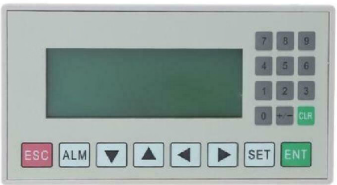
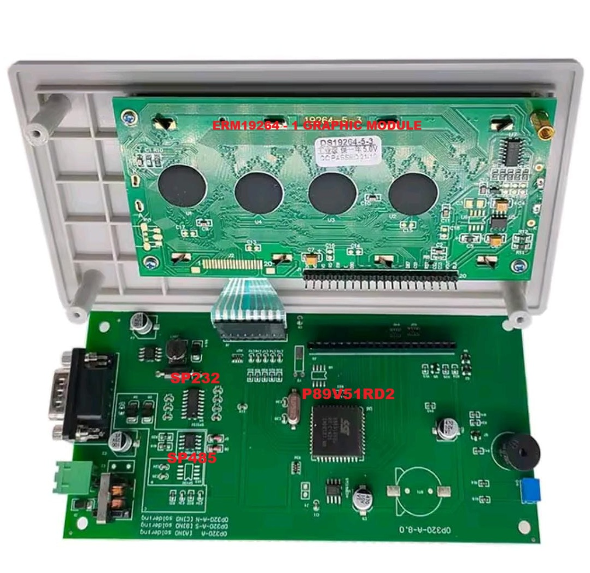

# OP320A
Este proyecto documenta y analiza el funcionamiento interno de la pantalla HMI OP320A, la cual utiliza un microcontrolador P89V51RD2 (familia 8051) como unidad de control principal. El objetivo es comprender su lógica de operación, protocolo de comunicación y explorar posibles interacciones con otros dispositivos o microcontroladores externos.

